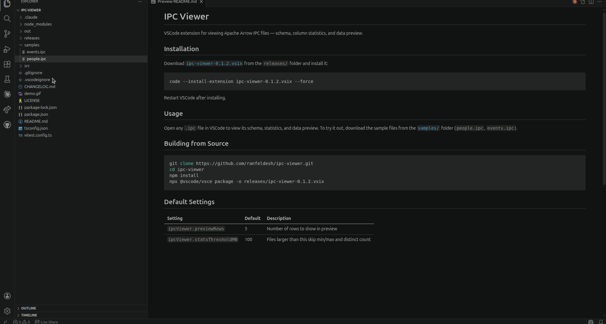

# IPC Viewer in VSCode

VSCode extension for viewing Apache Arrow IPC files — schema, column statistics, and data preview.



## VSCode Installation

If you just want to use the extension (rather than contribute code):

1. Download the `.vsix` file from [`releases/ipc-viewer-0.1.2.vsix`](releases/ipc-viewer-0.1.2.vsix) (click the download raw file button on the right side of the page). 
2. Install it:

```bash
code --install-extension ipc-viewer-0.1.2.vsix --force
```

3. Restart VSCode.

## Usage

Open any `.ipc` file in VSCode to view its schema, statistics, and data preview. To try it out, download the sample files from the [`samples/`](samples/) folder (`people.ipc`, `events.ipc`).

## Building from Source

For extension developers.

```bash
git clone https://github.com/ranfeldesh/ipc-viewer.git
cd ipc-viewer
npm install
npx @vscode/vsce package -o releases/ipc-viewer-0.1.2.vsix
```

## Default Settings

| Setting | Default | Description |
|---------|---------|-------------|
| `ipcViewer.previewRows` | 5 | Number of rows to show in preview |
| `ipcViewer.statsThresholdMB` | 100 | Files larger than this skip min/max and distinct count |
